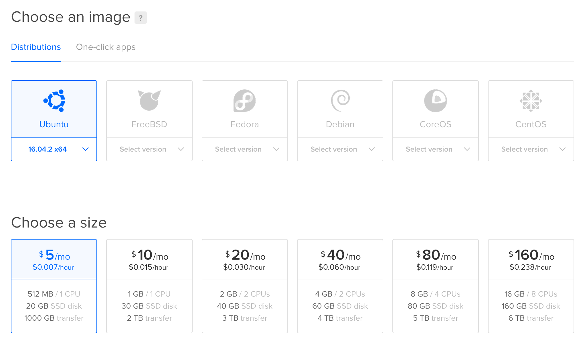
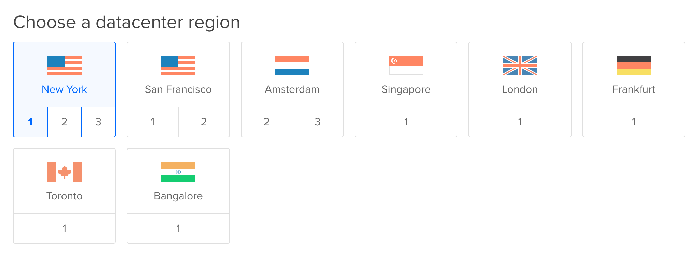
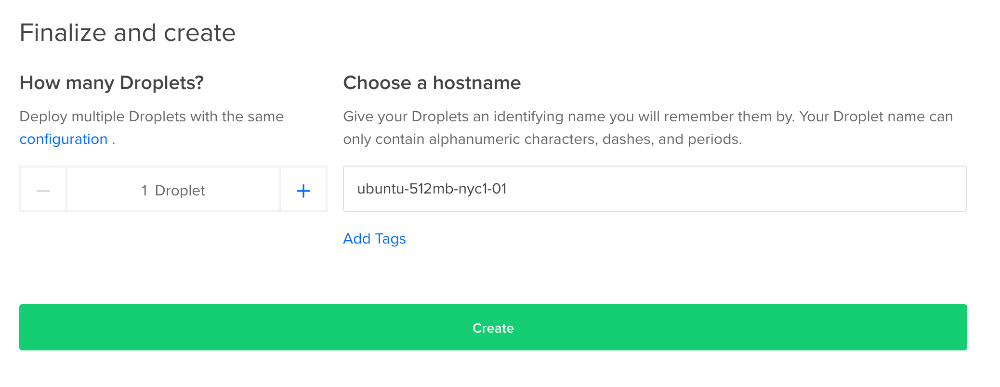

# Nephology

> I saw a city in the clouds. - Dagobahnian proverb

## Introduction to Cloud Computing

Nephology is the study of clouds. Few modern technology concepts (other than
maybe data science and artificial intelligence) have been hyped as loudly as "the
cloud." The cloud is simply a computer which you can access over the interent.
In this chapter we'll set up a cloud computer and we'll learn the basics of
interacting with one.

To get the most out of the this chapter you're going to need your credit or
debit card, or a [PayPal](https://www.paypal.com) account. We're going to be
using [DigitalOcean](https://m.do.co/c/530d6cfa2b37), a company which you
can rent cloud computers from. Throughout this chapter I might refer to cloud
computers as **servers** (computers connected to the internet) or as
**droplets**, which a marketing term DigitalOcean uses to refer to their
servers (a droplet is *not* a technical term). Renting from DigitalOcean won't
cost you any money since I'm giving you a coupon for two free months of service!
There are several companies that offer similar services compared to
DigitalOcean, but in my opinion they have the best user interface and the most
transparent pricing model.

**Warning:** *At the end of this chapter we will discuss how to shut down any
servers you've started on DigitalOcean. If you don't shut down your server
after two months then your account will be charged real money for using
DigitalOcean. Please be sure to shut down any servers you start after you are
finished using them.*

## Setting Up DigitalOcean

To get started with DigitalOcean we need rent a server from their website.
[Click this link](https://m.do.co/c/530d6cfa2b37) to sign up for DigitalOcean
in order to get two free months of server use. (If you don't use this link then
you don't get two free months). Click **Sign Up** in the upper right corner,
then enter your email address and choose your
password.


Check your email for a message from DigitalOcean and click the enclosed link to
confirm your email. Then you'll need to enter your credit or debit card
information, or your Paypal account details. As long as you close down all of
your servers less than two months after you start them you will not be charged.
After entering in your payment information you should see this screen:


Click the big blue **Create a new Droplet** button which should then bring you
to a screen where you can customize the server you're going to be renting. Make
sure you have Ubuntu chosen as your distribution, and select the $5 per month
size option:



Scroll down the page and then select the region that is geographically closest
to you. Some regions have multiple data centers, it doesn't matter which data
center you pick. Currently I'm in Baltimore, Maryland, USA, so I'm going to pick
the number 1 data center in New York:



Finally at the bottom of the page click the big green **Create** button in order
to start your server!



It will take a minute to launch the server, but once launched
you should receive an email from Digital Ocean with the details about your
new server. Included in this email you should find the IP address of your
server, the default username (which should be `root`) and a
randomly generated password that you will need to connect to
your server for the first time. Once you've received this email open up a new
terminal.

## Connecting to the Cloud

You can connect to computers on the interenet with the `ssh` program, which
stands for **S**ecure **Sh**ell. The `ssh` command provides a command line
interface to whichever computer you point it to. A computer that is connected to
the internet has an addresses (just like a house has an address) which is
specified by an **IP address**. The command for connecting to a computer with
`ssh` generally looks like this:


```bash
ssh [username]@[IP address]
```

Let's connect to your DigitalOcean server using `ssh`. Enter the following
command in the terminal substituting the IP address you received from
DigitalOcean for the IP address I'm using in this example:


```bash
ssh root@159.203.134.88
```

```
## The authenticity of host '159.203.134.88 (159.203.134.88)' can't be established.
## ECDSA key fingerprint is SHA256:UhtoIx/3c6/MmAIE+H8w5oGE06PsbXdzRRsAUhKtjhs.
## Are you sure you want to continue connecting (yes/no)?
```

Type `yes` and then press Enter.

```
## Warning: Permanently added '159.203.134.88' (ECDSA) to the list of known hosts.
## root@159.203.134.88's password:
```

This password should be in the email you received from DigitalOcean. Copy and
paste the password into the terminal, then press Enter.

```
## You are required to change your password immediately (root enforced)
## Welcome to Ubuntu 16.04.2 LTS (GNU/Linux 4.4.0-78-generic x86_64)
## 
##  * Documentation:  https://help.ubuntu.com
##  * Management:     https://landscape.canonical.com
##  * Support:        https://ubuntu.com/advantage
## 
##   Get cloud support with Ubuntu Advantage Cloud Guest:
##     http://www.ubuntu.com/business/services/cloud
## 
## 0 packages can be updated.
## 0 updates are security updates.
## 
## 
## 
## The programs included with the Ubuntu system are free software;
## the exact distribution terms for each program are described in the
## individual files in /usr/share/doc/*/copyright.
## 
## Ubuntu comes with ABSOLUTELY NO WARRANTY, to the extent permitted by
## applicable law.
## 
## Changing password for root.
## (current) UNIX password:
```

You now need to create a new password for this server. First paste in the old
password and press Enter. Then think of a new, strong password and enter it into
the console. Then enter the new password again to confirm. After entering in the
new passowrd you should have a prompt! Press enter a few times to make sure that
you get the prompt back each time. You're in!

Now you have access to all of the Unix commands you would normally have:


```bash
pwd
```

```
## /root
```

In order to disconnect from the server and return to your machine use `logout`.


```bash
logout
```

```
## Connection to 159.203.134.88 closed.
```

To reconnect to your server use `ssh` again:


```bash
ssh root@159.203.134.88
```

```
## root@159.203.134.88's password:
```

Enter your password and you should get the prompt back for your cloud server.

### Summary

- `ssh` connects you to computers that are connected to the internet. The
template for the command to connect is `ssh [username]@[IP address]`.
- To disconnect from an `ssh` session use the `logout` command.

## Cloud Computing Basics

### Moving Files In and Out of the Cloud

So now that you have a cloud computer, what can you do with it? One thing you
can do is store and retrieve files from a cloud computer. The program `scp`
allows you to copy local files to a server and it allows you to copy files on
a server to your local computer. First let's connect to our server so we can
create a file there:


```bash
ssh root@159.203.134.88
```

```
## root@159.203.134.88's password:
## # (Enter your password)
```


```bash
mkdir textfiles
echo "From the server" > textfiles/server-file.txt
logout
```

```
## Connection to 159.203.134.88 closed.
```

Now that we're back at the prompt on our local machine let's try getting
`server-file.txt` from our server. The arguments for copying files from a server
with `scp` have the following general structure:


```bash
scp [username]@[IP address]:path/to/file/on/server path/on/my/computer
```

This copies the file located on the server at `path/to/file/on/server` to a
local path at `path/on/my/computer`. In the same way you can copy an entire
folder from a server using the `-r` flag:


```bash
scp -r [username]@[IP address]:path/to/folder/on/server folder/on/my/computer
```

Let's try doing this now from our local computer. Enter your password when
you're asked to do so:


```bash
cd
pwd
```

```
## /Users/sean/
```


```bash
mkdir Cloud
cd Cloud
scp root@159.203.134.88:/root/textfiles/server-file.txt downloaded.txt
```

```
## root@159.203.134.88's password:
## server-file.txt                                         100%   16     1.2KB/s   00:00
```


```bash
cat downloaded.txt
```

```
## From the server
```

It worked! Now let's try uploading a file to our server. The arguments for doing
this are just the swapped arguments for downloading a file from a server:


```bash
scp path/on/my/computer [username]@[IP address]:path/to/file/on/server 
```

Let's create a file and upload it to our server:


```bash
echo "from local computer" > to-upload.txt
scp to-upload.txt root@159.203.134.88:/root/textfiles/uploaded-file.txt
```

```
## root@159.203.134.88's password:
## to-upload.txt                                           100%   20     1.8KB/s   00:00
```

Now let's log in to our server and we'll see if it's there:


```bash
ssh root@159.203.134.88
cat textfiles/uploaded-file.txt
```

```
## from local computer
```

Looks like it worked! Keeping files in the cloud allows you to work with the
same files in the same workspace as long as you have access to a terminal and
`ssh`.

### Talking to Other Servers

There are tons of servers out there on the internet! The way you're probably
used to talking to a server is through a web browser, but there are other ways
we can talk to servers on the command line. One of the most popular command line
programs for talking to other servers is `curl`. The `curl` command allows you
to send requests and information to other servers.

One easy task that we can use `curl` for is downloading files that are available
online. For example, this entire book and all of the files associated with it
are hosted on a server! You can find the Markdown file for one of the first
chapters of this book [here](http://seankross.com/the-unix-workbench/01-What-is-Unix.md).
To download a file with `curl`, you simply need to provide the `-O` flag and the
URL of the file:


```bash
curl -O http://website.org/textfile.txt
```

Let's try downloading the Markdown file from my website:


```bash
curl -O http://seankross.com/the-unix-workbench/01-What-is-Unix.md
```

```
##   % Total    % Received % Xferd  Average Speed   Time    Time     Time  Current
##                                  Dload  Upload   Total   Spent    Left  Speed
## 100  1198  100  1198    0     0  13681      0 --:--:-- --:--:-- --:--:-- 13770
```


```bash
head -n 5 01-What-is-Unix.md
```


```
## # What is Unix?
## 
## Unix is an operating system and a set of tools. The tool we'll be using the
## most in this book is a shell, which is a computer program that provides a
## command line interface. You've probably seen a command line interface in the
```

As we know servers have files on
them

### Automating Tasks

One wonderful


## Shutting Down Your Server

 curl, cron, ps
